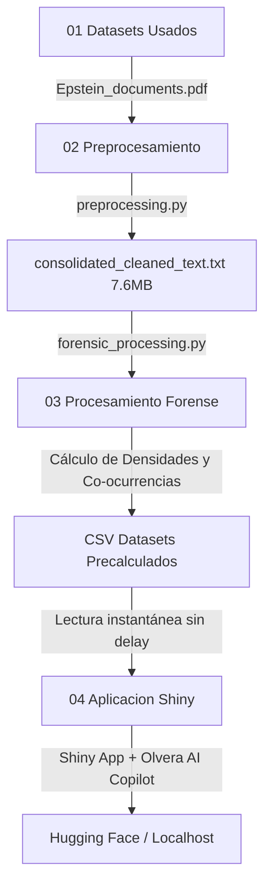

# Minería de Texto Forense y Análisis de Co-ocurrencia ⚖️🕵️‍♂️

> **Plataforma de Inteligencia Forense y NLP de Grado Industrial para Auditar los Expedientes Judiciales Desclasificados del Caso Epstein.**

[](https://www.python.org/)
[](https://shiny.posit.co/py/)
[](https://deepmind.google/technologies/gemini/)
[](https://huggingface.co/)

Esta plataforma avanzada aplica **Procesamiento de Lenguaje Natural (NLP)**, **Análisis de Sentimiento** y **Mapeo de Co-ocurrencias** para auditar y estructurar analíticamente un corpus masivo de **5,028 páginas** de testimonios jurados, deposiciones oficiales y registros de vuelo desclasificados judicialmente por orden de la Corte Federal del Distrito Sur de Nueva York.

---

## 🏗️ Arquitectura del Pipeline Analítico

El pipeline está diseñado bajo un enfoque modular y optimizado en 4 fases secuenciales más una fase de presentación de resultados, logrando una latencia ultrabaja en el renderizado de gráficos:



---

## 📂 Estructura del Proyecto

*   **`01 Datasets Usados/`**: Contiene la base de conocimiento en formato PDF (`Epstein_documents.pdf`), la cual posee el corpus digitalizado (5,028 páginas).
*   **`02 Preprocesamiento/`**:
    *   `preprocessing.py`: Script encargado de extraer el texto binario usando `pypdf` y aplicar higiene lingüística con expresiones regulares.
    *   `consolidated_cleaned_text.txt`: Corpus consolidado e higienizado de **7.6 MB** y **6.8 millones de caracteres** que erradica la latencia en las fases posteriores.
*   **`03 Procesamiento Forense/`**:
    *   `forensic_processing.py`: Script que realiza la minería lingüística, análisis de sentimiento, co-ocurrencias y densidad de riesgo.
    *   `forensic_*.csv`: Datasets resultantes precalculados para máxima velocidad del Dashboard.
*   **`04 Aplicacion Shiny/`**:
    *   `app.py`: Servidor y UI premium del Dashboard interactivo diseñado en estilo *Cyber-Noir*.
    *   `extractor.py`: Motor optimizado que lee los CSVs y provee los datos al dashboard en microsegundos.
    *   `logic.py` & `providers.py`: Capa de integración e inteligencia con modelos fundacionales (OpenRouter y Gemini).

---

## 🛠️ Detalle de Componentes y Algoritmos

### 🔹 1. Algoritmo de Higiene de Texto (`preprocessing.py`)
Utiliza expresiones regulares optimizadas en caliente para limpiar la extracción del PDF, colapsando saltos de línea de censuras y removiendo el ruido analógico:
```python
def normalize_legal_text(text: str) -> str:
    if not text: return ""
    # 1. Une palabras cortadas con guion al final de línea (separación silábica)
    text = re.sub(r'(\w+)-\s*\n\s*(\w+)', r'\1\2', text)
    # 2. Reemplaza saltos de línea y tabuladores por espacios simples
    text = re.sub(r'[\n\r\t]+', ' ', text)
    # 3. Elimina ruido tipográfico manteniendo signos gramaticales básicos
    text = re.sub(r'[^\w\s\-\#\@\.\,\:\;]', '', text)
    # 4. Colapsa múltiples espacios consecutivos en un espacio único
    text = re.sub(r'\s+', ' ', text)
    return text.strip()
```

### 🔹 2. Análisis de Sentimiento y Puntuación de Riesgo (`forensic_processing.py`)
Clasifica las páginas del expediente utilizando un léxico especializado en informática forense legal y calcula un **Índice de Riesgo Forense** cruzando tópicos críticos:
```python
def sentiment_score(pos: int, neg: int) -> tuple:
    total = pos + neg
    if total == 0: return 0.0, "Neutral"
    score = round((pos - neg) / total, 3)
    if score < -0.3:     cat = "Altamente Negativo"
    elif score < -0.05:   cat = "Negativo"
    else:                 cat = "Neutral / Procedimental"
    return score, cat
```

### 🔹 3. Integración de Olvera AI Copilot con Gemini
El Copilot conversacional interactúa de forma directa con la base de datos precalculada, inyectando dinámicamente un contexto enriquecido de RAG para no sobrecargar el navegador:
```python
# El contexto masivo se añade únicamente en memoria para el payload del LLM
if llm_messages and llm_messages[-1]["role"] == "user":
    llm_messages[-1]["content"] += ctx
```

---

## 📈 Hallazgos y Resultados Forenses Consolidados

A partir del análisis de las **5,028 páginas** y **1,323,138 palabras** del expediente judicial desclasificado, el motor analítico extrajo estadísticas concluyentes:

### 🤐 Tácticas de Evasividad Verbal Detectadas
Se detectaron un total de **2,338 instancias** de tácticas evasivas bajo juramento:

| Táctica de Evasividad Verbal Detectadas | Total de Instancias | Razón e Impacto Forense |
| :--- | :---: | :--- |
| **Objection** (Objeciones de Abogados) | 1,915 | Obstrucción sistemática de líneas de cuestionamiento clave. |
| **Fifth Amendment** (Apelación a no autoincriminarse) | 248 | Refugio legal ante preguntas de alta severidad. |
| **Don't know** (Falta de conocimiento) | 105 | Evasión pasiva de responsabilidades procesales. |
| **Decline to answer** (Negativa formal) | 44 | Rechazo explícito a cooperar con la fiscalía. |
| **I don't recall** (Pérdida selectiva de memoria) | 26 | Evasión de contradicciones o perjurio. |

### 👥 Mapeo de Personas de Interés y Densidad de Riesgo Forense
El cruzamiento semántico identificó la densidad de menciones asociadas a tópicos críticos (Abuso/Menores y Logística de Aviones):

| Persona de Interés | Total Menciones | Sentimiento | Riesgo Forense | Clasificación de Contexto |
| :--- | :---: | :---: | :---: | :--- |
| **Jeffrey Epstein** | 1,744 | -0.294 | 516 | Altamente Negativo / Foco Principal |
| **Ghislaine Maxwell** | 1,033 | -0.103 | 192 | Negativo / Co-organizadora |
| **Virginia Giuffre** | 528 | 0.266 | 42 | Positivo / Contexto de Víctima |
| **Prince Andrew** | 396 | -0.254 | 94 | Negativo / Red de Influencias |
| **Alan Dershowitz** | 234 | -0.234 | 77 | Negativo / Red de Influencias |

---

## 🛠️ Ejecución Local

### 1. Clonar el repositorio e instalar dependencias:
```bash
git clone <URL_DE_TU_REPOSITORIO_GITHUB>
cd epstein-forensic-text-mining
pip install -r requirements.txt
```

### 2. Configurar variables de entorno:
Crea un archivo `.env` dentro de la carpeta `04 Aplicacion Shiny/` con tus API Keys:
```env
OPENROUTER_API_KEY="tu_clave_aquí"
GROQ_API_KEY="tu_clave_aquí"
GEMINI_API_KEY="tu_clave_aquí"
TAVILY_API_KEY="tu_clave_aquí"
```

### 3. Ejecutar el Dashboard:
```bash
cd "04 Aplicacion Shiny"
shiny run --reload app.py
```

---

## 🐳 Despliegue en Hugging Face Spaces (Docker)

El proyecto incluye un `Dockerfile` optimizado en la carpeta raíz. Al subir los archivos de este directorio a tu Space de Hugging Face configurado con el SDK **Docker**, la plataforma compilará y desplegará la app automáticamente.

> **🔒 Seguridad**: Recuerda agregar tus claves (`OPENROUTER_API_KEY`, `GROQ_API_KEY`, etc.) de forma segura dentro de la sección **Variables de Entorno (Secrets)** en la configuración de tu Space en Hugging Face. Nunca subas el archivo `.env` al repositorio público.
