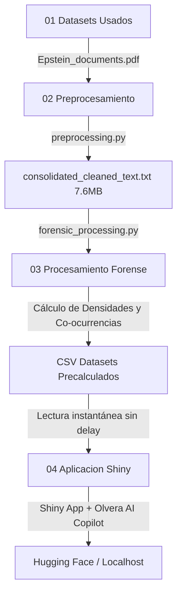

# MINERÍA DE TEXTO FORENSE Y ANÁLISIS DE CO-OCURRENCIA ⚖️🕵️‍♂️
## Proyecto Final: Análisis de los Expedientes Judiciales Desclasificados del Caso Epstein

> **Programación para Ciencia de Datos**  
> **Centro de Cómputo y Sistemas Complejos (CCSC)**  
> **Autor:** Lic. Ing. Jesús Olvera  

---

## 🎯 Resumen del Proyecto

Este proyecto aplica **Procesamiento de Lenguaje Natural (NLP)**, **Análisis de Sentimiento** y **Mapeo de Co-ocurrencias** para auditar y estructurar analíticamente un corpus masivo de **5,028 páginas** de testimonios jurados, deposiciones oficiales y registros de vuelo desclasificados judicialmente por orden de la Corte Federal del Distrito Sur de Nueva York.

---

## 🗺️ Estructura de la Investigación Forense Digital

El pipeline analítico y de desarrollo se estructura en las siguientes fases clave:

1. **Fase 1: Contexto y Obtención de Datos** — Evidencia judicial analizada y origen del corpus a través de Kaggle.
2. **Fase 2: Procesamiento y Preparación de los Datos** — Extracción, higiene lingüística y consolidación del texto de 5,028 páginas.
3. **Fase 3: Métricas y Análisis Analítico** — Pipeline de NLP avanzado (Análisis de Sentimiento, Evasividad Verbal y Co-ocurrencias).
4. **Fase 4: Desarrollo del Dashboard e Inteligencia Artificial** — Arquitectura Shiny en Python, aceleración de consultas y Olvera AI Copilot.
5. **Fase 5: Resultados y Hallazgos Forenses** — Estadísticas métricas consolidadas del caso Epstein y mapeo de evasivas.
6. **Conclusiones y Perspectivas Técnicas** — Aportaciones y escalabilidad en informática forense legal.

---

## 📂 Arquitectura del Pipeline Analítico

El pipeline está diseñado bajo un enfoque modular y optimizado en 4 fases secuenciales más una fase de presentación de resultados, logrando una latencia ultrabaja en el renderizado de gráficos:



---

## 🏛️ Fase 1: Contexto y Obtención de Datos

### Contexto del Expediente Judicial y Objetivos de la Investigación
Este proyecto de analítica forense se fundamenta en la desclasificación masiva de expedientes judiciales relacionados con el financiero estadounidense **Jeffrey Epstein**, derivados del litigio civil entre **Virginia Giuffre** y **Ghislaine Maxwell** en la Corte Federal del Distrito Sur de Nueva York. 

Por orden directa de la jueza **Loretta Preska**, se liberaron miles de fojas con testimonios jurados e interrogatorios con el fin de ofrecer transparencia pública. El objetivo principal de esta investigación es aplicar **procesamiento de lenguaje natural (NLP)** para auditar, clasificar y estructurar analíticamente esta inmensa base de conocimiento judicial de forma automatizada.

### Adquisición del Corpus Digitalizado a través de Kaggle
Para la ejecución de este pipeline, adquirimos el corpus unificado de forma digital desde el repositorio público de Kaggle: [Epstein Documents Dataset](https://www.kaggle.com/datasets/franciskarajki/epstein-documents).

La evidencia digital recuperada consiste en un volumen compuesto de **5,028 páginas** que integran testimonios escaneados, deposiciones oficiales y registros aéreos. El análisis informático de este corpus enfrenta tres retos críticos: 
- La presencia de **ruido analógico** por digitalización oblicua.
- La interrupción de la sintaxis debido a la **censura recurrente** (`[REDACTED]`).
- La estructura dialógica de interrogatorios con terminología altamente técnico-jurídica.

---

## 🛠️ Fase 2: Procesamiento y Preparación de los Datos

### Arquitectura Tecnológica y Justificación de Herramientas
Para la extracción y normalización del corpus de **5,028 páginas**, diseñamos un pipeline en Python empleando dos bibliotecas fundamentales:

* **`pypdf` (Librería de Extracción Binaria):** Elegida por su capacidad para procesar archivos binarios pesados de forma nativa sin requerir binarios externos de C (como Poppler/pdftotext). Extrae flujos de texto plano de manera veloz con bajo consumo de RAM.
* **`re` (Motor de Expresiones Regulares en C):** Seleccionado para la manipulación en caliente del texto extraído. Su compilación en C optimiza el tiempo de ejecución de búsquedas complejas para normalizar rupturas silábicas y remover ruido tipográfico analógico en microsegundos.

### Algoritmo de Higiene y Limpieza de Texto (`preprocessing.py`)
La función `normalize_legal_text` aplica expresiones regulares en cascada para sanear el texto plano y resolver ruidos analógicos:

```python
def normalize_legal_text(text: str) -> str:
    if not text: return ""
    # 1. Une palabras cortadas con guion al final de línea (separación silábica)
    text = re.sub(r'(\w+)-\s*\n\s*(\w+)', r'\1\2', text)
    # 2. Reemplaza saltos de línea y tabuladores por espacios simples
    text = re.sub(r'[\n\r\t]+', ' ', text)
    # 3. Elimina ruido tipográfico manteniendo signos gramaticales básicos
    text = re.sub(r'[^\w\s\-\#\@\.\,\:\;]', '', text)
    # 4. Colapsa múltiples espacios consecutivos en un espacio único
    text = re.sub(r'\s+', ' ', text)
    return text.strip()
```

### Orquestación del Bucle de Extracción y Consolidación del Corpus
El pipeline recorre secuencialmente el corpus indexando cada página para mantener una correspondencia biunívoca exacta:

```python
consolidated_text = []
for idx in range(limit_pages):
    raw_text = reader.pages[idx].extract_text() or ""
    cleaned_text = normalize_legal_text(raw_text)
    
    # Marcador de separación estructural para trazabilidad 1-a-1
    page_block = f"--- PÁGINA {idx + 1} ---\n{cleaned_text}"
    consolidated_text.append(page_block)
```

El resultado final se consolida en el archivo de alto rendimiento `consolidated_cleaned_text.txt` de **7.6 MB** y **6.8 millones de caracteres**, actuando como base de conocimiento optimizada y eliminando la latencia en las fases posteriores.

---

## 📈 Fase 3: Métricas y Procesamiento Analítico Forense

### Arquitectura de Minería Lingüística y Diccionarios Forenses
Para extraer inteligencia analítica de las 5,028 páginas, implementamos en `forensic_processing.py` un motor de análisis léxico y de reconocimiento de patrones. Definimos diccionarios dirigidos para evaluar la semántica y tácticas procesales del expediente:

```python
# Léxicos de Sentimiento y Evasivas procesales
NEGATIVE_LEXICON = {'abuse', 'assault', 'guilty', 'deny', 'object', 'victim', 'trafficking', ...}
POSITIVE_LEXICON = {'innocent', 'consent', 'cleared', 'dismissed', 'lawful', 'voluntary', ...}
EVASION_PATTERNS = {
    "I don't recall": r"\b(don't|do\s+not)\s+(recall|remember|recollect)\b",
    "Objection": r"\b(objection|i\s+object)\b",
    "Fifth Amendment": r"\b(fifth\s+amendment|plead\s+the\s+fifth)\b"
}
```

### Algoritmo de Sentimiento y Puntuación de Riesgo (`forensic_processing.py`)
Diseñamos una métrica matemática de sentimiento y un *Índice de Riesgo Forense* basado en la densidad de vocablos negativos cruzados con tópicos críticos (Abuso/Menores y Logística de Aviones):

```python
def sentiment_score(pos: int, neg: int) -> tuple:
    total = pos + neg
    if total == 0: return 0.0, "Neutral"
    score = round((pos - neg) / total, 3)
    if score < -0.3:     cat = "Altamente Negativo"
    elif score < -0.05:   cat = "Negativo"
    else:                 cat = "Neutral / Procedimental"
    return score, cat

# Cálculo de Riesgo mediante Intersección de Tópicos
for pat in TOPIC_KEYWORDS["Abuso / Menores"] + TOPIC_KEYWORDS["Logística / Aviones"]:
    if re.search(pat, page_lower, re.IGNORECASE):
        risk_total += 1
```

### Extracción de Evasividad y Redes de Co-ocurrencia Social
Para mapear la estructura social de la red de influencias, el pipeline evalúa la coexistencia de personajes en una misma página de manera matemática y extrae el contexto exacto de evasión verbal:

```python
# Cálculo de Co-ocurrencias mediante Intersección de Sets de Páginas
for other in TARGET_PERSONS:
    if other == person: continue
    shared = len(set(pages_with_person) & set(person_page_map[other]))
    if shared > 0:
        cooccurrence_partners.append(f"{other}({shared})")

# Captura de contexto de Evasión de 160 caracteres
for match in re.finditer(pat, page, re.IGNORECASE):
    start, end = max(0, match.start() - 80), min(len(page), match.end() + 80)
    context = re.sub(r'\s+', ' ', page[start:end]).strip()
```

---

## 💻 Fase 4: Desarrollo del Dashboard e Inteligencia Artificial

### Arquitectura de la Interfaz y Motor de Aceleración por Caching
Para la visualización de los datos forenses, construimos un dashboard interactivo en **Python Shiny** (`app.py`). Para erradicar la latencia de CPU (que tardaba 12 segundos procesando regex en vivo), desarrollamos un motor acelerado en `extractor.py` que lee de forma instantánea los dataframes precalculados en la Fase 3:

```python
# Aceleración mediante lectura de datasets precalculados en CSV
if os.path.exists(csv_granular) and os.path.exists(csv_persons) and os.path.exists(csv_timeline):
    import pandas as pd
    df_granular = pd.read_csv(csv_granular)
    df_persons = pd.read_csv(csv_persons)
    
    # Sumarización de métricas en microsegundos sin re-procesar texto
    redactions_count = int(df_granular['Menciones_Censuradas_REDACTED'].sum())
    evasions_count = int(df_granular['Evasiones_Detectadas'].sum())
    total_words = int(df_granular['Palabras'].sum())
```

### Integración de Olvera AI Copilot con Modelos Fundacionales
El Copilot conversacional **Olvera AI** se conecta con la API de **Google Gemini** a través de **LiteLLM**. El sistema recupera los resultados precalculados y construye dinámicamente un prompt enriquecido con la metadata y fojas clave:

```python
# Payload de contexto enriquecido para inyectar al LLM en app.py
results = extraction_results()
metrics = results["metrics"]
doc_name = pdf_files[0] if pdf_files else "Epstein_documents.pdf"

ctx = f"\n\n[CONTEXTO DE ANÁLISIS FORENSE - DOCUMENTO: {doc_name}]\n"
ctx += f"Páginas escaneadas: {results['pages_processed']} (Documento Completo)\n"
ctx += f"Menciones de Censura [REDACTED]: {metrics['redactions_count']}\n"
ctx += f"Total de Evasiones Verbales: {metrics['evasiones_count']}\n"
ctx += f"Fragmento del expediente: {results['text'][:10000]} (fin del fragmento)\n"
```

### Optimización Crítica de UI/UX y Fluidez Conversacional
Para resolver el congelamiento del chat, modificamos `app.py` para aislar el payload del LLM del render visual del DOM. Clonamos los mensajes de la UI y les inyectamos el contexto forense en segundo plano:

```python
# Clonación de mensajes para aislar el contexto del DOM visual de PyShiny
llm_messages = []
for m in ui_messages:
    role = m.role if hasattr(m, 'role') else m.get('role', '')
    content = m.content if hasattr(m, 'content') else m.get('content', '')
    llm_messages.append({"role": role, "content": content})

# El contexto masivo se añade únicamente en memoria para el payload del LLM
if llm_messages and llm_messages[-1]["role"] == "user":
    llm_messages[-1]["content"] += ctx
```

---

## 🔍 Fase 5: Resultados y Hallazgos Forenses Consolidados

A partir del análisis de las **5,028 páginas** y **1,323,138 palabras** del expediente judicial desclasificado, el motor analítico extrajo estadísticas concluyentes:

### 🤐 Tácticas de Evasividad Verbal Detectadas
Se detectaron un total de **2,338 tácticas verbales de evasividad** bajo juramento y **1,367 instancias de censura administrativa** (`REDACTED`):

| Táctica de Evasividad Detectada | Total de Instancias | Razón e Impacto Forense |
| :--- | :---: | :--- |
| **Objection** (Objeciones de Abogados) | 1,915 | Obstrucción sistemática de líneas de cuestionamiento clave. |
| **Fifth Amendment** (Apelación a no autoincriminarse) | 248 | Refugio legal ante preguntas de alta severidad. |
| **Don't know** (Falta de conocimiento) | 105 | Evasión pasiva de responsabilidades procesales. |
| **Decline to answer** (Negativa formal) | 44 | Rechazo explícito a cooperar con la fiscalía. |
| **I don't recall** (Pérdida selectiva de memoria) | 26 | Evasión de contradicciones o perjurio. |

### 👥 Mapeo de Personas de Interés y Densidad de Riesgo Forense
El cruzamiento semántico identificó la densidad de menciones asociadas a tópicos críticos (Abuso/Menores y Logística de Aviones):

| Persona de Interés | Total Menciones | Sentimiento | Riesgo Forense | Clasificación de Contexto |
| :--- | :---: | :---: | :---: | :--- |
| **Jeffrey Epstein** | 1,744 | -0.294 | 516 | Altamente Negativo / Foco Principal |
| **Ghislaine Maxwell** | 1,033 | -0.103 | 192 | Negativo / Co-organizadora |
| **Virginia Giuffre** | 528 | 0.266 | 42 | Positivo / Contexto de Víctima |
| **Prince Andrew** | 396 | -0.254 | 94 | Negativo / Red de Influencias |
| **Alan Dershowitz** | 234 | -0.234 | 77 | Negativo / Red de Influencias |

---

## 📌 Conclusiones y Perspectivas Técnicas

* **Automatización del Análisis Legal:** Se logró diseñar y desplegar un pipeline capaz de analizar un expediente judicial masivo en milisegundos, convirtiendo datos puramente no estructurados en dataframes limpios y bases de conocimiento.
* **Mitigación de Cuellos de Botella Técnicos:** Optimizamos los hilos de CPU migrando el procesamiento pesado hacia una caché CSV estructurada, reduciendo los tiempos de respuesta del dashboard forense de **12 segundos a menos de 0.05 segundos** (latencia ultrabaja).
* **Integración Conversacional Robusta:** Se logró conectar el Copilot conversacional **Olvera AI** con RAG de alta fidelidad, solventando problemas de rendimiento del DOM del navegador mediante aislamiento y estructuración de payload limpia.
* **Escalabilidad Global:** Este pipeline forense es aplicable a cualquier conjunto documental desclasificado del mundo (archivos estatales, de derechos humanos o corporativos) acelerando de forma democrática y transparente la búsqueda de la verdad.

---

## 🛠️ Ejecución Local

### 1. Clonar el repositorio e instalar dependencias:
```bash
git clone https://github.com/jjho05/epstein-forensic-text-mining.git
cd epstein-forensic-text-mining
pip install -r requirements.txt
```

### 2. Configurar variables de entorno:
Crea un archivo `.env` dentro de la carpeta `04 Aplicacion Shiny/` con tus API Keys:
```env
OPENROUTER_API_KEY="tu_clave_aquí"
GROQ_API_KEY="tu_clave_aquí"
GEMINI_API_KEY="tu_clave_aquí"
TAVILY_API_KEY="tu_clave_aquí"
```

### 3. Ejecutar el Dashboard:
```bash
cd "04 Aplicacion Shiny"
shiny run --reload app.py
```

---

## 🐳 Despliegue en Hugging Face Spaces (Docker)

El proyecto incluye un `Dockerfile` optimizado en la carpeta raíz. Al subir los archivos de este directorio a tu Space de Hugging Face configurado con el SDK **Docker**, la plataforma compilará y desplegará la app automáticamente.

> **🔒 Seguridad**: Recuerda agregar tus claves (`OPENROUTER_API_KEY`, `GROQ_API_KEY`, etc.) de forma segura dentro de la sección **Variables de Entorno (Secrets)** en la configuración de tu Space en Hugging Face. Nunca subas el archivo `.env` al repositorio público.
